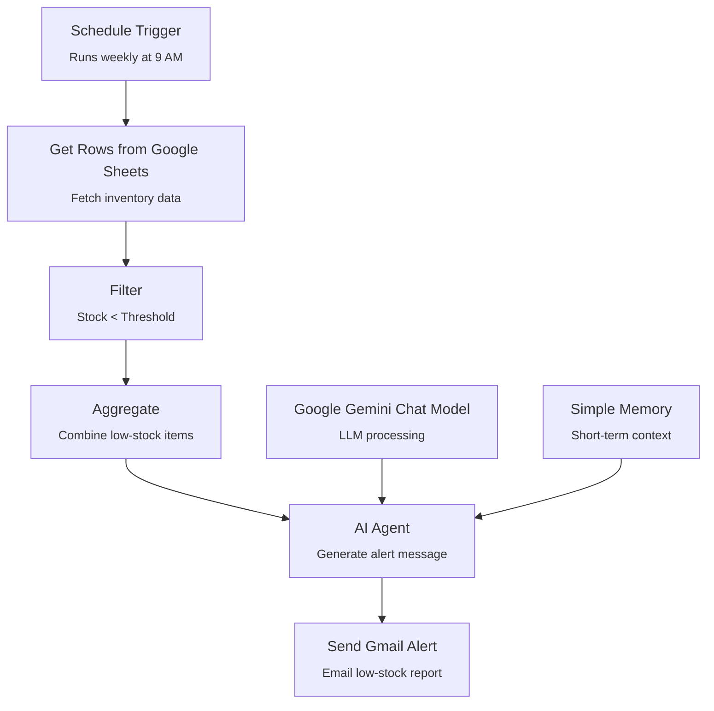

**Project 2: Inventory Check Automation**

You can drop this directly into:

```
docs/workflow-overview.md
```

---

# **Inventory Check Automation – Workflow Overview**



---

## **Schedule Trigger**

The workflow begins with a scheduled trigger that runs **every Monday at 9:00 AM**. This ensures consistent weekly inventory checks without manual intervention.

### JSON

```json
{
  "parameters": {
    "rule": {
      "interval": [
        {
          "field": "weeks",
          "triggerAtDay": [1],
          "triggerAtHour": 9
        }
      ]
    }
  },
  "type": "n8n-nodes-base.scheduleTrigger",
  "typeVersion": 1.3,
  "position": [0, 0],
  "id": "1e8711ed-bd12-4a66-b6a2-6abbdbc3886d",
  "name": "Schedule Trigger"
}
```

---

## **Get Rows from Google Sheets**

This node retrieves all inventory records from your Google Sheet. Each row typically includes:

- Item  
- Stock  
- Threshold  
- Supplier  

The data is passed downstream for evaluation.

### JSON

```json
{
  "parameters": {
    "documentId": {
      "__rl": true,
      "value": "1RdB2668K4glJUXVtjF7Nel3EF50zm-DjFEDLsrWVsZw"
    },
    "sheetName": {
      "__rl": true,
      "value": "gid=0"
    },
    "options": {}
  },
  "type": "n8n-nodes-base.googleSheets",
  "typeVersion": 4.7,
  "position": [208, 0],
  "id": "d1d35b53-ca5a-4476-91db-76c09564ece0",
  "name": "Get row(s) in sheet"
}
```

---

## **Filter**

The Filter node isolates only the items where:

\[
\text{Stock} < \text{Threshold}
\]

This ensures that only low‑stock items move forward in the workflow.

### JSON

```json
{
  "parameters": {
    "conditions": {
      "conditions": [
        {
          "leftValue": "={{ $json.Stock }}",
          "rightValue": "={{ $json.Threshold }}",
          "operator": { "type": "number", "operation": "lt" }
        }
      ],
      "combinator": "and"
    }
  },
  "type": "n8n-nodes-base.filter",
  "typeVersion": 2.3,
  "position": [416, 0],
  "id": "f3e921b4-df5e-4a6e-83bb-0111f497a60b",
  "name": "Filter"
}
```

---

## **Aggregate**

This node combines all low‑stock items into a single JSON object. This allows the AI Agent to generate **one consolidated alert message** instead of multiple emails.

### JSON

```json
{
  "parameters": {
    "aggregate": "aggregateAllItemData",
    "options": {}
  },
  "type": "n8n-nodes-base.aggregate",
  "typeVersion": 1,
  "position": [624, 0],
  "id": "ab51fdf3-0ede-43be-a625-1fdad0ddf9a6",
  "name": "Aggregate"
}
```

---

## **AI Agent**

The AI Agent generates a structured low‑stock alert message using the aggregated data. It follows your custom prompt rules:

- Start with “⚠️ Low Stock Alert:”  
- One line per item  
- If stock = 0 → “Out of stock”  
- No summaries or extra commentary  

### JSON

```json
{
  "parameters": {
    "promptType": "define",
    "text": "=Act as a diligent, professional Inventory Control Assistant..."
  },
  "type": "@n8n/n8n-nodes-langchain.agent",
  "typeVersion": 3.1,
  "position": [832, 0],
  "id": "64ef95da-914d-4325-a513-458ae4203a74",
  "name": "AI Agent"
}
```

---

## **Google Gemini Chat Model**

This is the LLM used by the AI Agent to generate the alert message. It interprets the aggregated inventory data and produces a clean, readable output.

### JSON

```json
{
  "parameters": {
    "options": {}
  },
  "type": "@n8n/n8n-nodes-langchain.lmChatGoogleGemini",
  "typeVersion": 1,
  "position": [704, 208],
  "id": "ba999a1b-0f50-441f-a422-4a4452523491",
  "name": "Google Gemini Chat Model"
}
```

---

## **Simple Memory**

Stores short‑term context for the AI Agent. While this workflow is not conversational, memory ensures consistent behavior during execution.

### JSON

```json
{
  "parameters": {
    "sessionIdType": "customKey",
    "sessionKey": "={{$execution.id}}"
  },
  "type": "@n8n/n8n-nodes-langchain.memoryBufferWindow",
  "typeVersion": 1.3,
  "position": [848, 208],
  "id": "120c62b4-8f1d-4950-a28c-76977a45a017",
  "name": "Simple Memory"
}
```

---

## **Send Gmail Alert**

This node sends the final AI‑generated alert message to the designated email address. It delivers a clean, actionable summary of all low‑stock items.

### JSON

```json
{
  "parameters": {
    "sendTo": "Mwelukaunga@gmail.com",
    "subject": "Low Stock Alert",
    "message": "={{ $fromAI('Message', ``, 'string') }}"
  },
  "type": "n8n-nodes-base.gmailTool",
  "typeVersion": 2.2,
  "position": [992, 208],
  "id": "501c1355-3f1c-42a9-a851-f7b0dad4954e",
  "name": "Send a message in Gmail"
}
```

---

# **Connections**

These connections define how data flows between nodes and how the AI Agent interacts with the Gemini model, memory, and Gmail tool.

### JSON

```json
{
  "Schedule Trigger": {
    "main": [[{ "node": "Get row(s) in sheet", "type": "main", "index": 0 }]]
  },
  "Get row(s) in sheet": {
    "main": [[{ "node": "Filter", "type": "main", "index": 0 }]]
  },
  "Filter": {
    "main": [[{ "node": "Aggregate", "type": "main", "index": 0 }]]
  },
  "Aggregate": {
    "main": [[{ "node": "AI Agent", "type": "main", "index": 0 }]]
  },
  "Google Gemini Chat Model": {
    "ai_languageModel": [[{ "node": "AI Agent", "type": "ai_languageModel", "index": 0 }]]
  },
  "Simple Memory": {
    "ai_memory": [[{ "node": "AI Agent", "type": "ai_memory", "index": 0 }]]
  },
  "Send a message in Gmail": {
    "ai_tool": [[{ "node": "AI Agent", "type": "ai_tool", "index": 0 }]]
  }
}
```

---

# **How the Whole System Works**

The Inventory Check Automation workflow performs a complete weekly audit of your inventory. It retrieves all items from Google Sheets, filters out only those below their threshold, aggregates them into a single dataset, and passes them to the AI Agent. The Gemini model generates a clean, structured alert message listing all low‑stock items, and Gmail delivers the final report. This automation eliminates manual review, reduces errors, and ensures timely restocking decisions.

---

